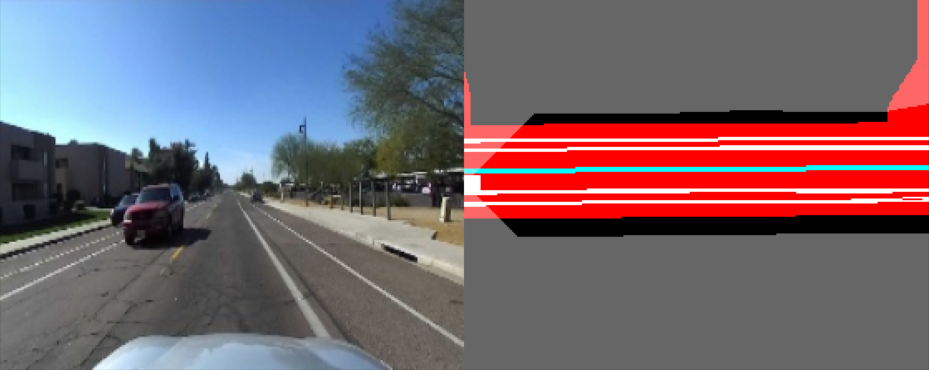

# RoadPerception Dataset

The dataset consists of pairs of RGB images from vehicle mounted cameras, and their corresponding bird's eye view (BEV) of the road ahead.\
Each BEV array has spatial dimensions of 224x280 with 11 channels, or layers (224x280x11 in total). Each layer is a binary map describing a different element of the road, e.g. lane dividers, crosswalks, the road itself, etc - full list presented below. The last layer is the occlusion mask, which marks areas not visible by the camera due to walls and other occluding structures.\
Each pixel in this map represents a square on the ground of side length 26.78cm. The map is oriented such that the camera is in the center of the left side, looking horizontally to the right. The entire map stretched 75 meters in the forward direction (horizontal), and 30 meters to either side of the camera, 75x60 meters in total.

All images come from rectilinear cameras with horizontal and vertical FOVs of 90 and 58.7 degrees, respectively.

The notebook `rp_vis_example.ipynb` contains example code for loading and visualizing samples from the dataset.

## Requirements

- Pytorch 1.x
- OpenCV
- Pandas
- Matplotlib
- blosc:
  `pip install blosc`

## Data and Visualization

Download it from [here](https://roadperception.s3.us-east-2.amazonaws.com/data/roadperception_dataset.tar).\
  

- Input: [192x320x3] images, from either forward / left / right / backward camera.
- GT: [224x280x11] binary top-down layers, which cover 75x60 meters (in parentheses - color in visaulization): - Road (red) - Stop lines (yellow) - Speed bumps (purple) - Dashed lane dividers (cyan) - Continuous lane dividers (white) - Marked crosswalks (light green) - Parking spaces (dark green) - Parking borders (gray) - Painted islands (orange) - Unmarked crosswalks (light blue) - Occlusion mask - buildings, walls and other static obstacles (transparent)
   

For more examples, run: `rp_vis_example.ipynb`
